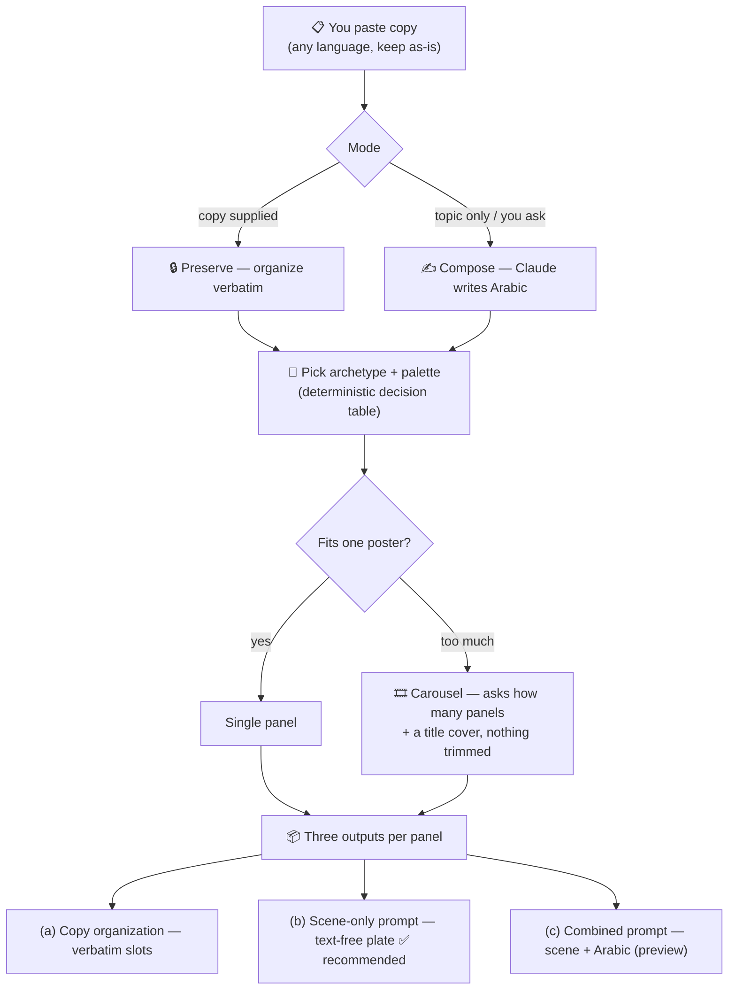

<div align="center">

# 🇸🇦 arabic-editorial-infographic

**A [Claude](https://claude.com/claude-code) skill that turns your copy into vertical, right-to-left Arabic editorial infographic posters & carousels** — in the style of a curated Saudi/Gulf design reference.


</div>

---

## What it does

You paste copy (usually Arabic). The skill **keeps your wording exactly as-is**, organizes it into an editorial layout, and hands you ready-to-use prompts for any text-to-image model — plus a reliable route for perfect Arabic type.

It never rewrites, translates, or invents. Numbers, punctuation, and word order stay verbatim.

## How it works



## The three outputs (per panel)

| Output | What it is | When to use |
|---|---|---|
| **(a) Copy organization** | Your text mapped to slots (kicker / headline / dek / body / stats / source), **verbatim** | Always — your source of truth |
| **(b) Scene-only prompt** | A **text-free** background plate with measured safe zones | ✅ **Recommended** — generate it, then typeset the Arabic in an RTL editor |
| **(c) Combined prompt** | Scene **+** the exact Arabic text in one prompt | Quick preview — long Arabic often garbles in image models |

> **Why scene-only?** Text-to-image models mangle long Arabic script. Generating a clean background and typesetting the words yourself is the only reliable path to perfect type.

## Design system (from the reference board)

**Six archetypes** — chosen deterministically by content:

| Archetype | For | Default palette |
|---|---|---|
| 🌃 Dark cinematic place/landmark | places, tourism, megaprojects | `#0E2A33` · `#C9A24B` · `#F3EAD3` |
| 📜 Light warm editorial | economy, policy, partnerships | `#F3EAD3` · `#0B3D2E` · `#C9A24B` |
| 💗 Storytelling human-interest | one person's story | `#EFE7D6` · `#5B2A4A` · `#C7275E` |
| 🎖️ Profile / portrait editorial | a named figure / leader | `#111111` · `#C9A24B` · warm grey |
| 💡 Creative-concept think-piece | how-to, listicle, opinion | `#B5432A` · `#F3EAD3` · `#C9A24B` |
| 📊 Data-dense stat poster | reports, rankings, sectors | `#0E2A33` · `#C9A24B` · `#F3EAD3` |

Gold `#C9A24B` is the through-line accent across the whole system — numerals, kicker, and the one accented headline word.

**House style:** vertical RTL poster · a giant Arabic display headline (stacked) · a graded photographic/illustrated hero · oversized gold stat numbers with tiny labels · film-grain, official/cinematic warmth. Plus documented **two-column comparison** and **table** layout modes.

## Example (preserve mode)

Input: `القدية: مدينة الترفيه الأولى. تبلغ مساحتها 360 كم². المصدر: مشروع القدية.`

→ **(a)** Headline `القدية: مدينة الترفيه الأولى` · Stat `360 كم² — المساحة` · Source `مشروع القدية`
→ **(b)** night render of a futuristic entertainment city, turquoise→navy, gold horizon, empty headline + stat zones
→ **(c)** the same scene with the three exact strings placed.

## Install

```bash
git clone https://github.com/elmarakpy/arabic-editorial-infographic.git \
  ~/.claude/skills/arabic-editorial-infographic
```

Then, in Claude Code:

```
/arabic-editorial-infographic
```

…or just paste copy and ask Claude to *“turn this into an Arabic infographic.”*

## Repo structure

```
arabic-editorial-infographic/
├── SKILL.md                       # workflow, two modes, guardrails
└── references/
    ├── design-system.md           # archetypes, palettes, layout modes, RTL/numeral rules
    └── prompt-template.md          # prompt skeletons + worked examples
```

## Guardrails (built in)

- 🔒 **Verbatim** — never reword, translate, reorder, or normalize digits unless you ask.
- 🚫 **No fabrication** — never invents a statistic, source, logo, or emblem.
- 🎞️ **Never trims** — overflow becomes a carousel; every word is preserved.
- 🎨 **Mood fits the content** — no patriotic framing on a tender story or an opinion piece.

---

<div align="center">
<sub>Built with 🤖 <a href="https://claude.com/claude-code">Claude Code</a> · design system extracted from a curated Saudi/Gulf infographic reference.</sub>
</div>
